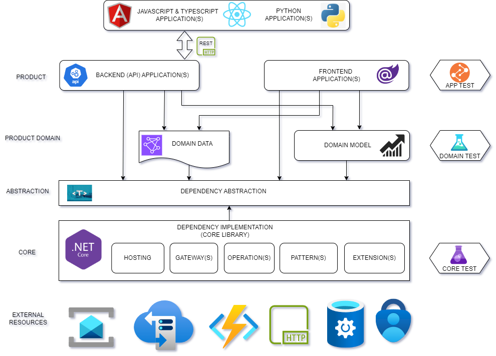
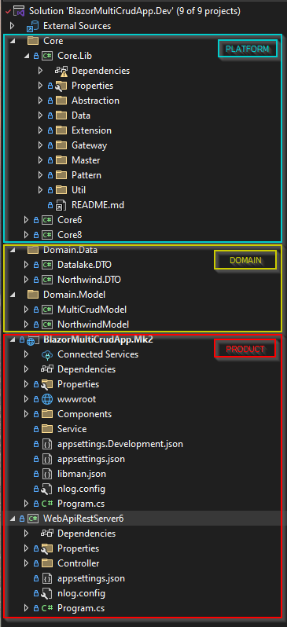
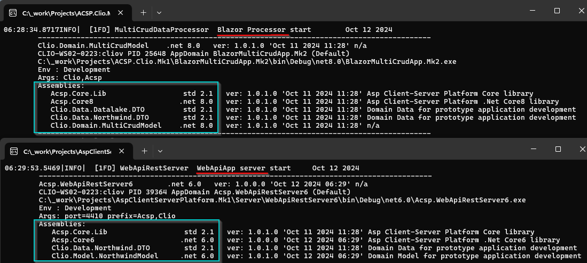
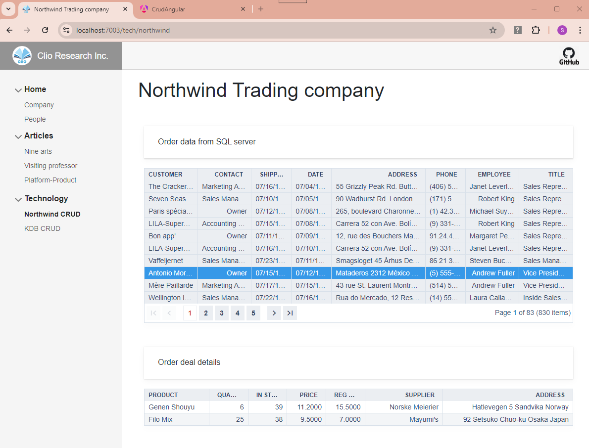

# Platform-Product Solution Architecture

This architectural pattern emerged at the beginning of the year 2023 and evolved through several iterations. The main driving force behind it was the desire to extract all the assorted and repeating little patterns and coding solutions present in the multitude of similar projects and to packaged them in a single well designed and tested platform implementation. Such platform could be then reused across most of the future solutions, drastically reducing code repetition as well as untested badly designed code.

The solution architecture in question has been produced, implemented and refined to a degree that it was used professionally with reasonable success.  I believe this architecture can be particularly useful for startups which frequently are challenged for producing a high quality software with little resources and time.

> Please note: This public repository is not made as a coding tutorial, but rather as an illustration of Platform-Product Solution Architecture and what can be achieved if it is used in software product development. Anybody who might be interested in the implementation details, or possibly sees this Solution Architecture as potentially useful for their own projects, please contact me directly.

The background for the Platform-Product concept can be traced to a few article(s) written couple of years ago:

https://github.com/SergeyKarpov914/PlatformProductDemo/blob/master/docs/CleanArchitectureStudy.md

Here is the latest diagram of the  Platform-Product Solution Architecture:

## Composition of a typical Platform-Product solution

There are five distinct architectural layers in solution. I will enumerate them staring from the most important one:

1.	Abstractions
2.	Core
3.	Product domain
4.	Product
5.	External resources

The reason I consider Abstractions the first is due to its central role as a dependency source for all the others. If I chose to have circular diagram, the Abstractions would be in the center of the circle.

The Abstractions, Code and Product Doman make the Platform. Products can be quickly developed and when built on top of the Platform.

A typical Visual Studio C# solution implementing two products: a WebApi server and Blazor UI application, will look something like this:

The Platform interacts directly with External resources: Cloud Services, Databases, Messaging services, Security, SaaS Functions, Remote connections, etc. The library code includes implementation of multiple gateways which provide connectivity to assorted data and service counterparts, varying from SQL databases to storage Blobs and SaaS Functions.

Platform can be extended to accommodate connectivity to virtually limitless variety of external resources, such as PDF managers, Email services, Signature validators, Financial Pricing models, FIX protocol adapters, Image processors, etc.

The Product Domain has features which can be attributed both to Platform and Product. I tend to think of Domain related more to Platform because there can be multiple Products built on the same Domain modules. Product Domain code change cadence is usually less intense than that of an Application.

## Repository structure

The Platform can be used as a base for variety of products built for .Net runtime:

1. API servers
2. Blazor Web applications
3. Backend servers
4. Command-line batch jobs
5. Desktop WPF presentation
6. Backend for Javascript/Typescript and Python products.

> An example of Javascript front-end application, created within the Platform has been put here: https://github.com/SergeyKarpov914/PlatformProductDemo/tree/master/WebApp.JS/clio-demo-react

There are currently two Product samples in the solution: an Asp.Net Core WebAPI server and Blazor Server application. When I run both executables in this solution (Server and Blazor UI) the top of the log for these projects show the assembly composition:

Note, the Platform assemblies are built with different targets: .Net Standard 2.1, .Net 6.0 and .Net 8.0. This illustrates the flexibility of Platform-Product Solution Architecture.

## Gateways and Datasources

The Blazor application includes a simple CRUD interactive screen which draws data from multiple tables in an SQL Server database. 

All the code for interaction with the database, combining related result sets into business Entities and formatting the properties for displaying is implemented at the Platform-Domain level. Razor page has a minimal code-behind, which just binds ViewModel collection with an items source property of a (Radzen) data-grid.

The SQL data source depends on a connection to private SQL server (or private Azure SQL database). If the Blazor application in this repository is built without access to mentioned sources it will show empty grids. 

My son is going through his software building practice after graduation, so I asked  him to dump the sample database into XML/CSV files and to write a new gateway for those local file data sources. This is expected to be ready in a few days. The Platform configuration implementation should be flexible enough to adjust connection strings at runtime.

Normally the Blazor UI application should look like this:

