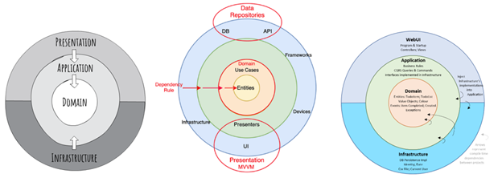
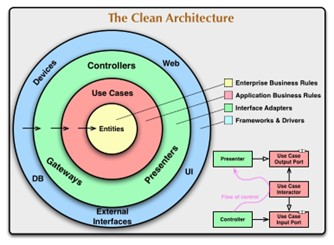
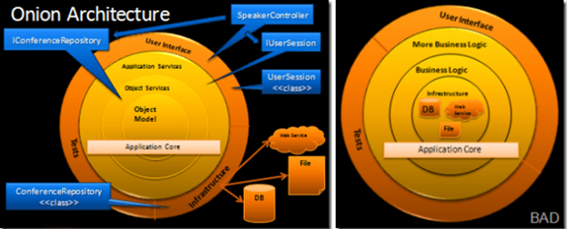
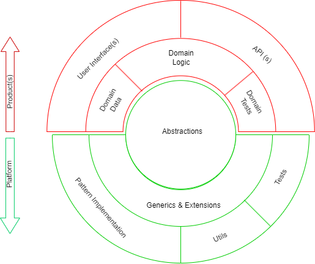

# 'Clean Architecture’ concept, expanded.

  - [The genesis of the ‘Clean Architecture’ and circular diagram](#the-genesis-of-the-clean-architecture-and-circular-diagram)
  - [Was there anything before ‘Clean Architecture’?](#was-there-anything-before-clean-architecture)
  - [What can be adjusted in the concept?](#what-can-be-adjusted-in-the-concept)
    - [Dependency pattern](#dependency-pattern)
    - [Modularity and packaging](#modularity-and-packaging)
  - [Software production and the players involved](#software-production-and-the-players-involved)
  - [Enter Platform-Product architecture concept.](#enter-platform-product-architecture-concept)
  - [Summary](#summary)

In recent times, my attention was caught by multiple postings and YouTube clips with the same name. Most of them were starting their narration about ‘Clean Architecture’ with attractive looking con-centric circular diagrams:

It seems, these diadrams and the rational behind them, promoted by variuos authors in the past couple of years, can be traced back to the work of Robert ‘Uncle Bob’ Martin. This work was conducted about a decade before the recent spike in the interest to ‘Clean Architecture’.

## The genesis of the ‘Clean Architecture’ and circular diagram

In his blog (circa 2012), Martin formulates his vision of the concept and published the, now so popular, circular diagram.

https://blog.cleancoder.com/uncle-bob/2012/08/13/the-clean-architecture.html

In 2017, the text from the blog transitioned into the Chapters 21 and 22 of the classic book on the subject. Robert Martine writes:

_ _THE PURPOSE OF AN ARCHITECTURE 
Good architectures are centered on use cases so that architects can safely describe the structures that support those use cases without committing to frameworks, tools, and environments. Again, consider the plans for a house. The first concern of the architect is to make sure that the house is usable—not to ensure that the house is made of bricks. … A good software architecture allows decisions about frameworks, databases, web servers, and other environmental issues and tools to be deferred and delayed. Frameworks are options to be left open. A good architecture makes it unnecessary to decide on Rails, or Spring, or Hibernate, or Tomcat, or MySQL, until much later in the project. A good architecture makes it easy to change your mind about those decisions, too. A good architecture emphasizes the use cases and decouples them from peripheral concerns.
… By separating the software into layers and conforming to the Dependency Rule, you will create a system that is intrinsically testable, with all the benefits that implies. When any of the external parts of the system become obsolete, such as the database, or the web framework, you can replace those obsolete elements with a minimum of fuss._ _

https://www.amazon.com/Clean-Architecture-Craftsmans-Software-Structure/dp/0134494164

## Was there anything before ‘Clean Architecture’?

Incidentally, the software architecture circular diagram and dependency rules can be seen few years before it appeared in Martin’s blog.

Jeffrey Palermo introduced an architectural pattern, called Onion Architecture, 15 years ago, in 2008.

https://jeffreypalermo.com/tag/onion-architecture/

Jeffrey Palermo writes:

_The object model is in the center with supporting business logic around it.  The direction of coupling is toward the center.  The big difference is that any outer layer can directly call any inner layer.   With traditionally layered architecture, a layer can only call the layer directly beneath it.  
Infrastructure is pushed out to the edges where no business logic code couples to it.  The code that interacts with the database will implement interfaces in the application core.  The application core is coupled to those interfaces but not the actual data access code.  In this way, we can change code in any outer layer without affecting the application core.  
We include tests because any long-lived application needs tests.  Tests sit at the outskirts because the application core doesn’t couple to them, but the tests are coupled to the application core.  We could also have another layer of tests around the entire outside when we test the UI and infrastructure code._

_Key tenets of Onion Architecture:_
- _The application is built around an independent object model_
* _Inner layers define interfaces.  Outer layers implement interfaces_
* _Direction of coupling is toward the center_
+ _All application core code can be compiled and run separate from infrastructure_

_Although I don’t call out an IoC container as a key tenet, when using a mainstream language like Java or C#, an IoC container makes the code fit together very easily._

## What can be adjusted in the concept?  

### Dependency pattern

All Martinesque ‘Clean Architecture’ diagrams, while different in details, have one thing in common: they all are  Domain-centric. If we are speaking in Visual Studio solution structure terms, all projects in solution depend on the one that implements Domain Entities.

It occurs to me that Domain-centric approach to architecture may not accurately reflect challenges presented by the kind of  software industry I’m working in. Dependency of an Infrastructure code on Domain data and logic is questionable.

This is especially problematic with the outer (framework) layer. Replacing obsolete frameworks, the way Martin sugests, means developing custom frameworks, tailored to a particular domain model. 

In case of frameworks like EF, every change in domain model does indeed cause migration of the whole ORM implementation, but it certainly does not have to be that way.

Then there is also the matter of a missing letter ‘D’ (as in SOLID). It would be interesting to consider how does Dependency Inversion factors into the ‘Clean Architecture’ context.

## Software production and the players involved

To address concerns about code reuse and assembly structure, I would like to touch upon the aspect of software production and the players involved.

Few general questions popped in my mind:

- How is a professional software system produced, and by whom?
* How are components of such system distributed between the parties involved in production?
+ What is the best strategy for converting a software system into a commercial product?

I deliberately avoid using verb ‘develop’ with regards to a professional software application. 
This is done because development team is just one player in a path between software application conception and delivery of a working application to users. There are other players, which are instrumental in completing this path.

The other main player is **product management**. 

Someone must be able to formulate what the product will be and it would be nice to have somebody to know how to sell it. 

The relationship between software development and product management is, in most cases, a many-to-many relationship. There are multiple products in various stages of delivery at any given time, and development teams need to optimize their time and effort to satisfy multiple product requirements.

The separation between development and product management exists not only within large corporations and commercial software shops. The same is true in case of start-ups and freelancers. A start-up is concentrated on a product and usually most interested on the time to market. A freelance developer is usually not involved in product decisions and is concentrated on the development of the best code. 

This brings us to the third question (which I will rephrase) – what is the best architectural approach we can take to optimize development phase, in real life, where success is measured by timely delivery of the most competitive commercial product?

## Enter Platform-Product architecture concept

Introducing a transformation of the ‘Clean Architecture’ architecture and concentric circular diagram. 
It is not difficult to notice that the Product part of my diagram contains almost all the same components which can be found on the ‘Clean Architecture’ representations circulated around the web.  

The diagram is deliberately split into two separate parts. This is done to indicate that any given Platform can be and is used as a base for multiple Products, and each Product can be combined with different versions of a Platform, or different Platforms all together.

There is also a prominent ‘Abstractions’ circle in the middle of the diagram. The key patterns, necessary for the system functioning, are implemented in the outer implementation layer of the Platform. The key components in the Domain layer need to be able to use the pattern implementations but should not depend on them. 
They depend on abstract representation of the patterns instead. And with that Dependency Inversion principle is being promptly followed. 

I prefer to call my flavor of the system architecture a **‘Platform-Product’**.

It seems, the architectural ideas of Jeffrey Parlermo meet my own better that those of Robert Martin. Palermo makes the emphasys on dependency upon interfaces, rather than implementations, and underlying importance of embedded tests, which I also think are the most important aspects.

## Summary

Platform-Product architecture provides the following:

1.	**Independent development lifecycle**. Platform takes substantially more time and effort to deliver. Once a Platform becomes stable, it can facilitate a rapid Product development.  
2.	**Dependency inversion**. Product depends on Abstractions (interfaces), Generics and Extension methods, exposed by Platform. Specific implementation of various patterns and utilities within a Platform  does not change the way a dependent Product functions. Dependency injection is used to resolve abstraction and to facilitate loose coupling.
3.	**Flexible packaging**. Depending on the type of relationship between development and product management, a Platform can be offered in form of a code or as .NET assemblies (NuGet packages).
4.	**Code minimalization**. A Product built on top of a Platform, tends to come up as very compact, with many advantages it brings, reliability, readability, easy packaging, and distribution among them. 
5.	**Test coverage**. The test project(s) are created upfront with the goal of providing a test coverage for close to 100% of code, which is used to implement the injectable components. 
6.	**Adherence to design and coding principles**. Design-first, modular approach to software construction complies perfectly to the basic principles of software craftsmanship, known by their acronyms: SOLID, DRY, YAGNI and KISS.

The development of different parts of a professional software system is usually driven by different people, with varying priorities and schedules. Moreover, parts of a system have different requirements for complexity, style and SDLC. There is a demand for code reuse, avoiding repetition and ability to provide independent testing, packaging, and deployment.

Platform-Product approach extends the concept of ‘Clean Architecture’, which might provide a solution to real world complications. 

